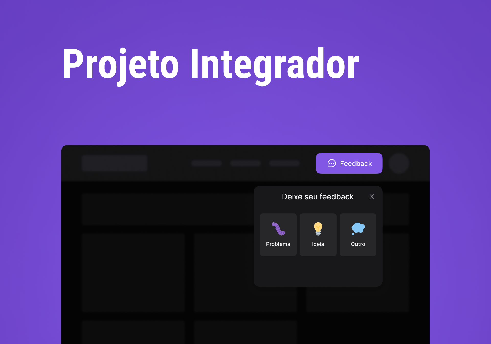
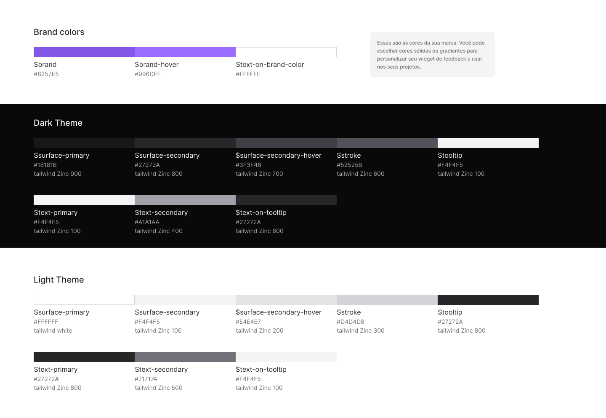
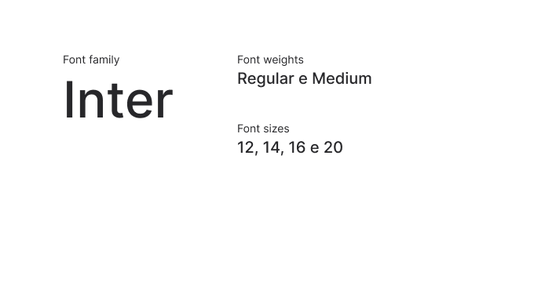
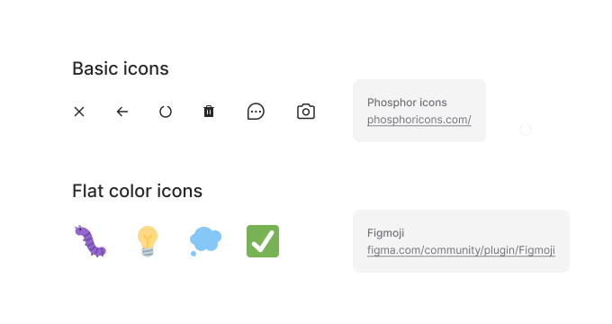
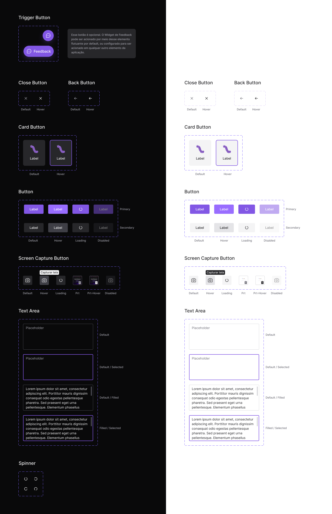
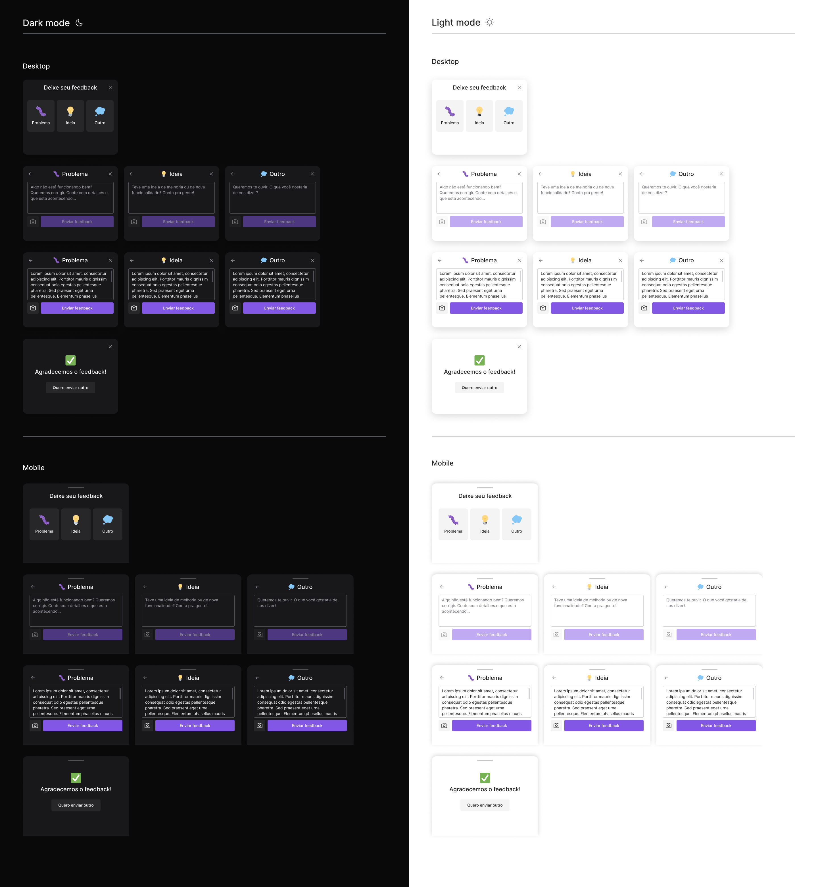

<p align="center">
  <a href="#-layout">Layout</a> •
  <a href="#-technologies">Techs</a> •
  <a href="#-getting-started">Iniciando</a> •
  <a href="#-license">Licença</a>
</p>

<p align="center">
  
</p>

## 🔖 Design System

Você pode conferir o layout no link abaixo:

- [Projeto Integrador - Figma](https://www.figma.com/file/UNdNdLZa9Az1BxgBM7QG51/Projeto-Integrador?node-id=7%3A2)

### Cores
<p align="center">
  
</p>

### Tipografia
<p align="center">
  
</p>

### Icones
<p align="center">
  
</p>

### Componentes
<p align="center">
  
</p>

### Layout
<p align="center">
  
</p>

## 🚀 Techs

- [ReactJS](https://reactjs.org/)
- [Tailwind CSS](https://tailwindcss.com/)
- [TypeScript](https://www.typescriptlang.org/)
- [React Native](https://reactnative.dev/)
- [Expo](https://expo.io/)
- [Vitejs](https://vitejs.dev/)
- [Express](https://expressjs.com/)
- [Prisma](https://www.prisma.io/)

## 💻 Iniciando

### Requisitos

- [Node.js](https://nodejs.org/en/)
- [Yarn](https://classic.yarnpkg.com/) ou [npm](https://www.npmjs.com/package/npm)
- [Expo CLI](https://docs.expo.dev/workflow/expo-cli)

**Clone o projeto e acesse o diretório**

```bash
git clone https://github.com/sanderdsz/projeto-integrador.git && cd projeto-integrador
```

### Servidor

```bash
# Na raiz do projeto acesse o diretório 'server' 
$ cd server

# Instale as dependencias
$ npm install

# Faça uma cópia do '.env.example' para '.env'
# e crie as SUAS variaveis
$ cp .env.example .env

# Com o postgreSQL rodando, execute as migrations
$ npx prisma migrate dev

# Inicie o servidor
$ npm run dev
```

### Web

**Tenha certeza que o servidor esteja rodando para prosseguir:**

```bash
# Na raiz do projeto acesse o diretório 'web'
$ cd web

# Instale as dependencias
$ npm install

# Faça uma cópia '.env.local.example' para '.env.local'
$ cp .env.local.example .env.local

# Inicie a aplicação
$ npm run dev
```

### Mobile

**Tenha certeza que o servidor esteja rodando para prosseguir:**

```bash
# Na raiz do projeto acesse o diretório 'mobile'
$ cd mobile

# Instale as dependencias
$ npm install

# Para emular com android:
$ npm run android

# Para emular com iOS:
$ npm run ios

# Ou apenas teste o bundle
$ npm run start
```

### Notas:
<li>
Basta seguir os passos acima para que sua aplicação rode. Porém, é preciso configurar o backend para que as funcionalidades do feedback funcione corretamente.
</li>
<li>
Altere o arquivo .env.examplo para .env.local para que o vitejs consiga carregá-lo. Nota: a variável precisa iniciar com VITE_ para ser carregada corretamente (ex.: VITE_BASE_URL_API).
</li>

## 📝 Licença

O projeto está sob MIT License - [LICENSE](LICENSE) para mais detalhes.

---

